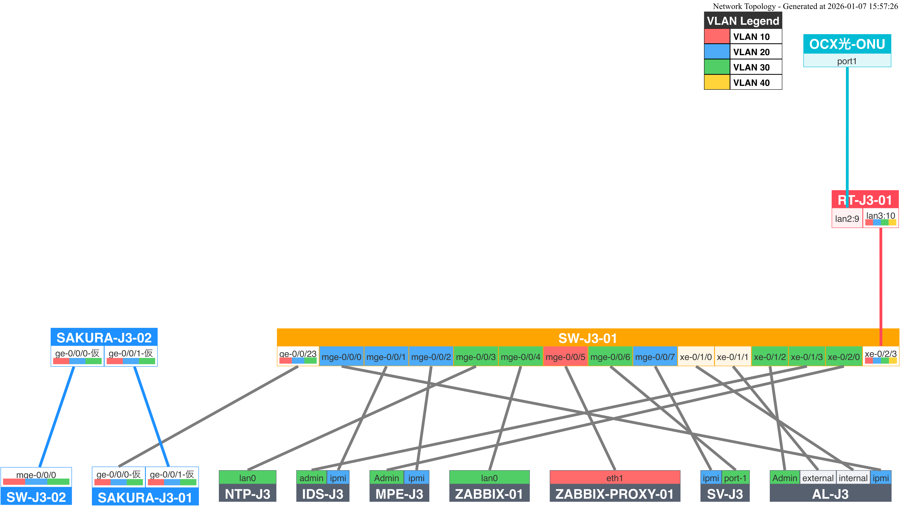

# Network Topology Generator

注記: 本リポジトリに含まれる情報はすべて公開情報です。

## 概要

- NetBox から機器・インターフェイス・ケーブル情報を取得し物理トポロジー図を生成
- [Shumoku](https://www.npmjs.com/package/@shumoku/netbox) を使用してインタラクティブなHTML出力
- Netbox Webhook をトリガーとして配線情報に変更があれば GitHub Actions で自動生成・デプロイ
- GitHub Pages で [https://janog57-noc.github.io/network-topology/](https://janog57-noc.github.io/network-topology/) に公開



## 必要なもの

- [Bun](https://bun.sh/) または Node.js
- NetBox API アクセス用の環境変数
  - `NETBOX_URL`
  - `NETBOX_TOKEN`


## セットアップ

```bash
git clone https://github.com/janog57-noc/network-topology.git
cd network-topology
bun install
```

## 使い方（ローカル）

```bash
# 環境変数を設定
export NETBOX_URL=https://netbox.example.com
export NETBOX_TOKEN=YOUR_API_TOKEN

# HTML生成
make generate

# 生成してローカルサーバーで確認
make serve
```

`http://localhost:8000/` で確認できます。

## 主要コマンド

| コマンド          | 説明                          |
| ------------- | --------------------------- |
| `make generate` | NetBoxからトポロジーHTMLを生成        |
| `make serve`    | 生成してローカルサーバーで確認             |
| `make clean`    | 生成物を削除                      |

## GitHub Actions

- ワークフロー: `.github/workflows/netbox-pages.yml`
- トリガー: `repository_dispatch` (NetBox Webhook 用), `push` (main), 手動実行
